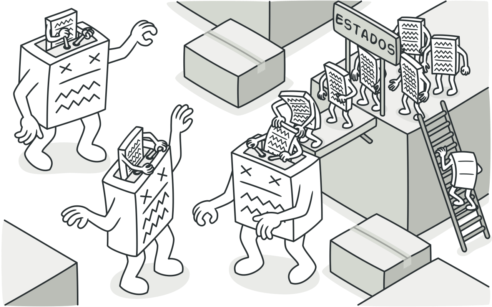
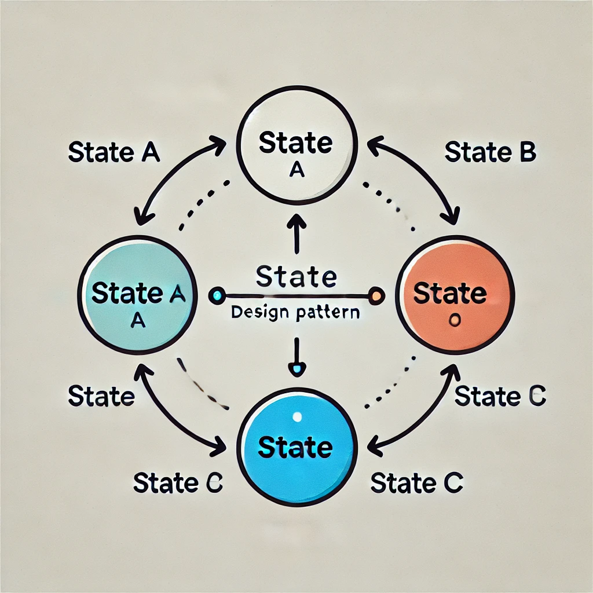
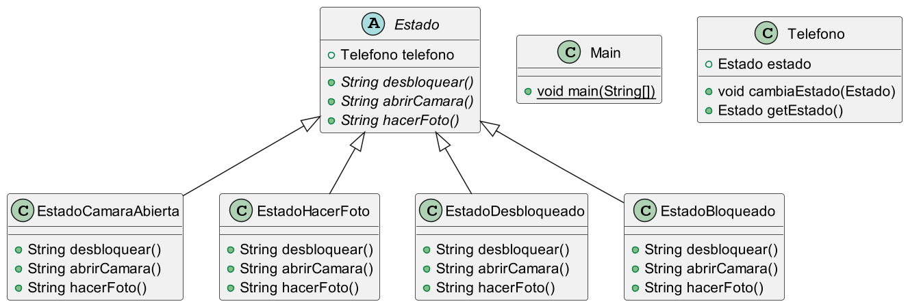
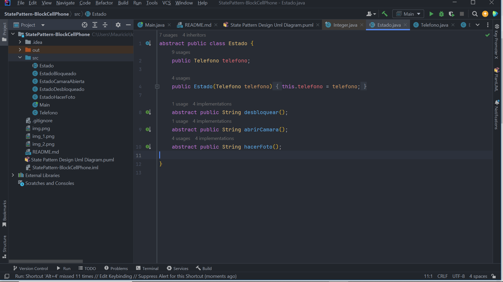
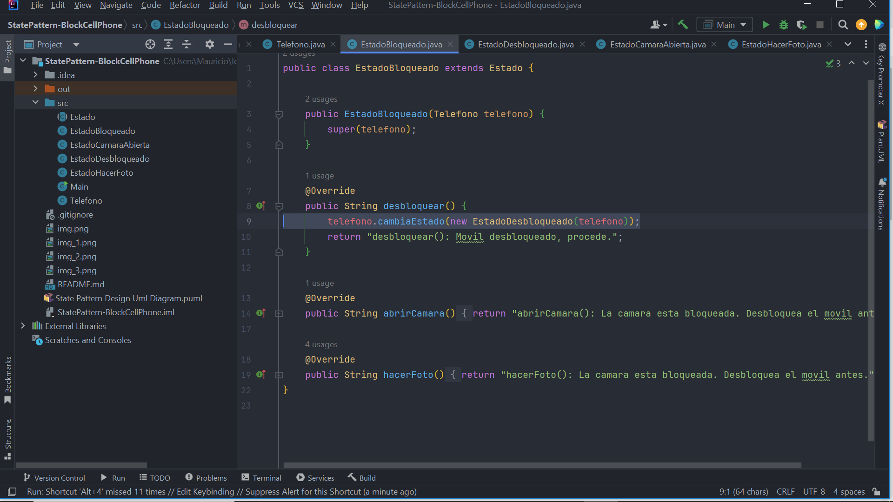
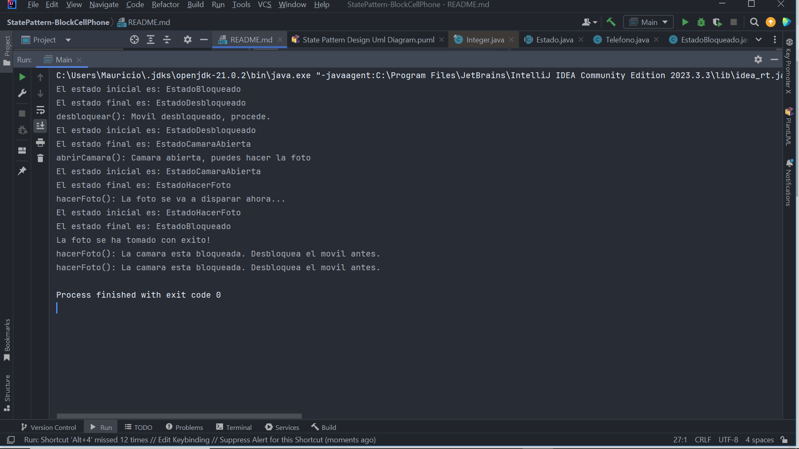

## State Design Pattern

### Type: behavioral

The State design pattern allows an object to change its behavior when its internal state changes. This is achieved by encapsulating the possible states in different classes that implement a common interface, and the parent object delegates its behavior to the corresponding state class. Thus, the same object can behave differently depending on the state it is in, eliminating the need for multiple conditionals in the code.

This pattern is useful when an object has multiple states and its behavior varies based on these states.

The State design pattern is a behavioral pattern. These types of patterns focus on how objects interact and communicate with each other, helping to manage object responsibilities and define clearer control flows. In the case of the State pattern, it allows an object to dynamically alter its behavior based on its internal state, promoting more flexible and maintainable code. It looks like the object changes its class.

Image Source: https://refactoring.guru/images/patterns/content/state/state-es-2x.png

### Plant Uml Diagram for this project:

In our example project we have the use case referring to a mobile phone system, which generates a flow of necessary and mandatory states to be able to take a photo. To do this, the state of the phone must go from being in a locked state to an unlocked state, then it must go to the open camera state before being able to go to the required state called the take photo state. If we try to take the photo without having gone through the required states first, we would get an alert message:

So as we pass through a required state it can generate the new instance required to move to a new state, thus changing the internal state of the object.

### Advantages of the State pattern:

Elimination of complex conditionals: Avoids the proliferation of if-else or switch statements in the code, since each state has its own class that handles the specific behavior.

Easier maintenance and extension: Adding new states is easier, since it only involves creating new classes that implement the state interface without altering existing code.

Separation of responsibilities: Each state class is responsible for defining the behavior in a specific context, promoting the single responsibility principle (SRP).

Facilitates dynamic behavior change: The object can change its behavior at runtime simply by changing its internal state.

### Disadvantages of the State pattern:

Increase in the number of classes: Since each state has its own implementation, the number of classes can increase considerably, which can make the project more complex.

**Initial complexity:** 

Although it simplifies the code in the long term, the initial implementation of the State pattern can be more complex, especially in simple systems that do not require transitions between many states.

Difficult to understand in simple systems: For small or low-state projects, it can seem like over-engineering and complicate the design without offering much benefit.

### Combination with other patterns:

**Strategy pattern:** State and Strategy are very similar in structure, but while Strategy is used to exchange algorithms, the State pattern focuses on changing behavior based on internal state. Both can be combined if you want to handle different strategies depending on the state of an object.

**Factory pattern:** Can be used in conjunction with the Factory pattern to create the different states. A factory can take care of creating the appropriate state based on certain parameters, which encapsulates the creation of the objects and improves scalability.

**Singleton pattern:** In cases where states do not need to maintain internal information and can be shared, the Singleton pattern can be used to ensure that there is only one instance of each state.

**Observer pattern:** Can be useful if you want to notify other objects about state changes in an object. For example, an object that changes state could inform other interested objects using Observer.

The combination of these patterns depends on the problem you are solving, but together they can create flexible and well-structured systems.

This is ok...